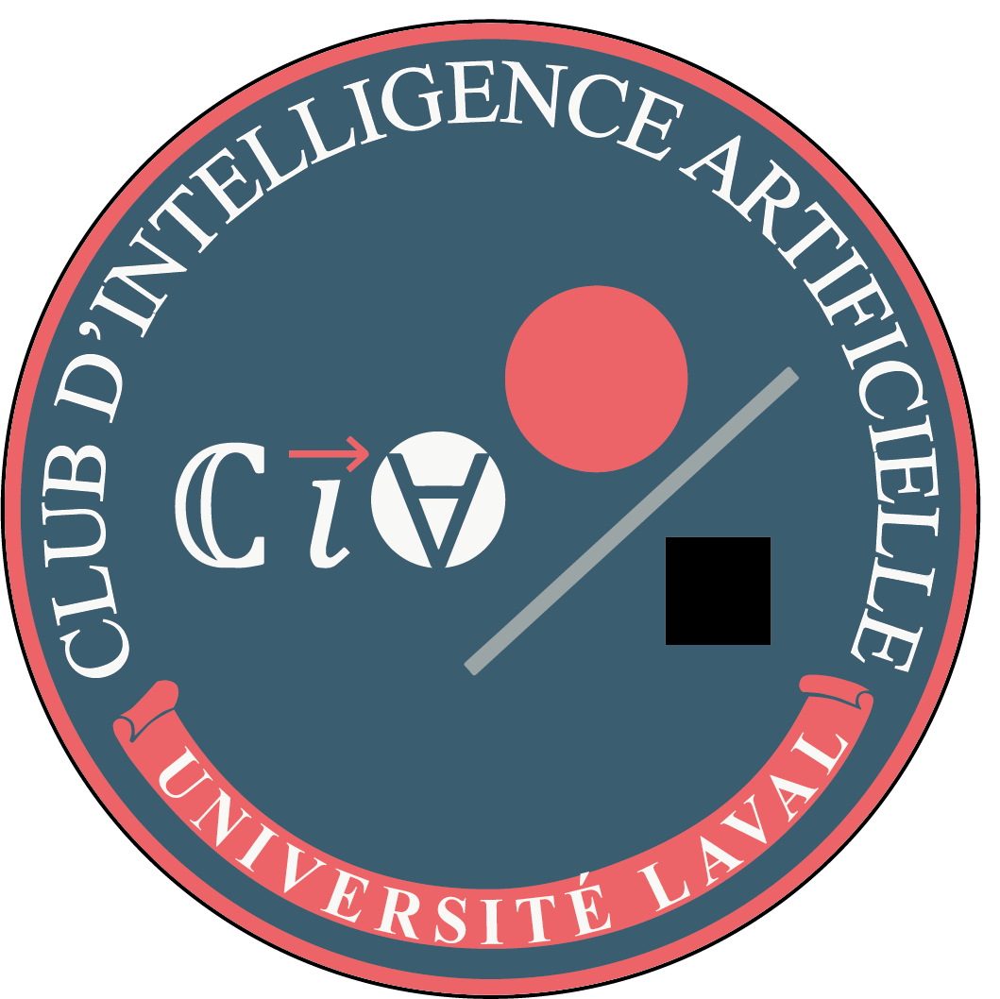

# 🧠 Artificial Intelligence Club - Université Laval

  

## 🌐 Project Description

Welcome to the official repository of the **Artificial Intelligence Club (CIA)** from **Université Laval**.  
This website's mission is to **showcase our projects**, **share our achievements**, and **document our progress** in the field of artificial intelligence.  

It will also serve as a **central hub** for our **contact information**, **social media**, and any other **external communication**. 🚀

The website is **under continuous development**, and we are excited to regularly add **new content**, **features**, and updates to highlight our **collective progress**.

---

## 💻 Technologies Used

This project relies on several modern technologies:  

- **HTML / CSS / JavaScript** 
- **React.js**  
- **Vue.js** 
- **Bootstrap** 

---

## 🚀 Contribution

We are always open to **contributions**!  
Whether you are a club member or simply passionate about AI, feel free to:  

- **Suggest improvements** 💭  
- **Report bugs** 🐛  

To contribute, simply clone the repository, create a new branch, and submit a Pull Request (PR).  
We will carefully review each contribution. 🤝  

---

## 📬 Contact

To follow us or get in touch, you can find us on:  

- 💻 [Our Website]() *(under development)*  
- 📸 [Instagram](https://www.instagram.com/ciaulaval/)
- 📧 [LinkedIn](https://www.linkedin.com/company/cia-ulaval/posts/?feedView=all)

Don't hesitate to contact us for any questions, collaborations, or just to exchange ideas. 🧠✨

---

## 📅 Continuous Updates

This website is **actively being developed**,  
Stay tuned for upcoming updates! 🚀

---

## Author: @Dereckbelanger152

